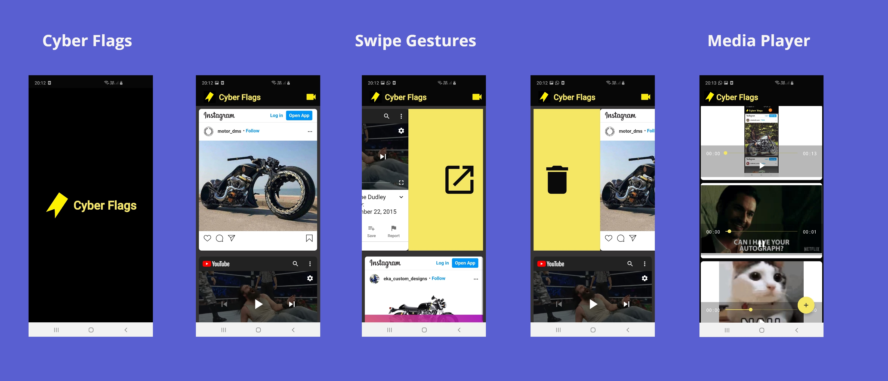

# Cyber Flags

> My entry for ACM-Apptitude

> <Subtitle>
> Cyber-Flags allows you to store all your links/posts from Instagram, Youtube, etc in a single space, while retaining their visual prowess.
> The app also allows you to play multiple videos simultaneously for comparison or other usage.

----

## Screenshots

## Video

- https://drive.google.com/file/d/1sC8UELlj0zCHxFJMv9tT6yIyV5oJu6vf/view?usp=drivesdk
- https://youtu.be/Qj25HMQnMdU

## Features
-  Serves as a single destination to store all your interesting data.
-  Posts can be categorized into Entertainment, Research and miscellaneous, and can be directly opened into respective apps or browsers upon click.
-  You can sync all your data using an account, and retrieve it on other devices.

## Problem statements
- Media player has been implemented through Exomedia. The user can simultaneously play upto 3 videos in a single screen, which can be useful for comparison of code related videos.
- Swipe gestures have been implemented on the recycler view containing posts. User can swipe right to delete the post, and swipe left to open it under respective browser or app. Undo+delete option is also included.
- Unit tests have been implemented for all activities and recycler views.

## Instructions to run
Install and run the "Cyber-Flags" apk file.

## Contributors
- <a href="https://github.com/Ishan-001">Ishan Khandelwal</a>
